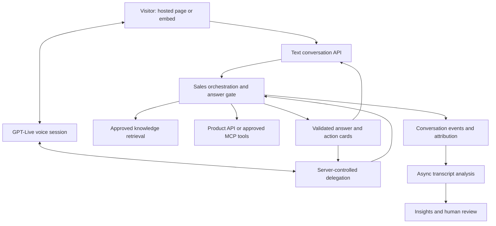

# Standalone sales assistant — product and technical specification

Version 1.0 · 22 September 2026 · Proposed proof of concept

Audience: product owner, designer and implementation team.

This is a specification, not an implementation or a claim that the integrations already exist. Defaults, limits, timings and release targets below are proposed product decisions. Provider capabilities are sourced separately. Store this document with WyvStudio for planning; build the application in its own repository, infrastructure and release pipeline.

## 1. Product decision

Build a standalone app that lets a business publish an AI sales assistant on a hosted page and, later, embed it on its website. The business supplies approved knowledge, product facts and sales guidance. Visitors can type or speak, get relevant demonstrations and plan recommendations, proceed to checkout, or explain what prevents a purchase.

WyvStudio is the first business using the app. The system must not hard-code WyvStudio names, plan prices, URLs or capabilities into the agent implementation.

**Primary objective:** increase suitable customers completing a purchase and becoming successful users. Secondary objective: capture evidence about lost sales and knowledge gaps. Do not optimize raw purchase volume at the expense of misleading promises, refunds or unsuitable purchases.

**Recommended starting point:** text + optional voice, approved knowledge, a narrow product API, grounded answers, checkout attribution and transcript analysis. Evaluate avatars in a separate technical experiment after the sales workflow works.

## 2. What “training” means here

Uploading a document does not need to change a model's weights. The first release uses retrieval-augmented generation: extract content, index approved passages, retrieve relevant evidence at question time, and give it to the agent.

Three distinct stores are required:

| Store | Purpose | Example |
|---|---|---|
| Knowledge library | Explanations and reference material | Tutorials, FAQs, demo transcripts, onboarding guides |
| Structured product facts | Exact, current business claims | Plan price, currency, billing period, limits, supported workflows |
| Sales playbook | Approved conversational behavior | Discovery questions, objection responses, escalation rules |

Later fine-tuning may help style or recurring classification tasks, after evaluation on consented/redacted examples. It is not the source of truth for changing prices, policies or features. Uploaded material and customer transcripts must not automatically become fine-tuning data.

OpenAI File Search is a managed retrieval option with a documented file-type list; it is not a universal audio/video ingestion pipeline. This spec instead proposes application-owned extraction and indexing so timestamps, source approval, deletion and tenant isolation are explicit. [File Search documentation](https://developers.openai.com/api/docs/guides/tools-file-search)

## 3. Users and permissions

- **Business owner:** creates the organization, configures spending/retention/integrations, manages members and publishes agent releases.
- **Knowledge editor:** uploads sources, fixes extracted content and submits changes for approval. Cannot change checkout credentials or publish restricted product claims without permission.
- **Sales analyst:** reviews conversations, labels objections and outcomes, corrects analysis, exports permitted reports.
- **Sales representative:** handles customer-requested follow-ups and handoffs. Sees only assigned/authorized conversations.
- **Visitor:** asks questions anonymously or identifies themselves voluntarily. Uploads are private to their conversation and never authoritative product knowledge.
- **Platform operator:** manages service health, with audited, restricted access to customer content.

POC: one business, one agent, a small invited team. Still include organization IDs and enforce isolation in every data/query/tool path so adding businesses does not require redesigning access control.

## 4. POC scope and boundaries

### Included

1. Standalone admin app and branded public conversation page.
2. Approved knowledge ingestion from web pages, PDFs, documents, audio and video.
3. Text chat with evidence-backed answers and relevant demo cards.
4. Optional GPT-Live voice experiment backed by the same sales logic.
5. Versioned product facts, plan eligibility and approved checkout destinations.
6. Read-only product integration; minimal, confirmed writes for leads and checkout-session creation.
7. Saved transcripts, outcome tracking, objection analysis and human correction.
8. Evaluation suite, operational logs, quotas and kill switches.

### Deferred

Self-service SaaS billing, arbitrary marketplace connectors, outbound calling, automatic marketing campaigns, broad CRM replacement, autonomous discounts/refunds, purchase execution, custom domains, custom avatars and general browser/computer control.

A POC may start with hosted conversations before an embed. Neither requires modification of WyvStudio's editor or generation pipeline.

## 5. Business setup experience

The setup flow should ask for information in manageable sections, not one long form:

1. **Business and goal:** product name, approved domains, target customer, main conversion action, brand colors and greeting.
2. **Knowledge:** upload or link material, inspect processing results and approve sources.
3. **Product facts:** connect an API or complete structured forms for plans, limits, supported use cases and policies.
4. **Sales playbook:** communication style, discovery questions, objection handling, forbidden promises and handoff route.
5. **Voice:** optional voice/language selection, microphone demo and session limits. Avatar configuration remains separate.
6. **Test:** ask sample questions; inspect evidence and missing knowledge; run regression cases.
7. **Publish:** immutable agent release with preview, release notes and rollback. Publishing requires a functioning fallback/handoff path and current price data if pricing recommendations are enabled.

Use familiar labels such as “Knowledge”, “Product facts” and “Test your assistant”. Avoid implying that an upload is already understood or published while extraction or approval is pending.

## 6. Knowledge ingestion requirements

### 6.1 Supported inputs and proposed POC limits

| Input | Processing | Required evidence location |
|---|---|---|
| Website URL | Fetch readable page content; optionally crawl an approved domain | Canonical URL, heading, fetched timestamp |
| PDF | Extract text; OCR scanned pages; capture important tables/diagrams | File version and page number |
| DOCX, TXT, Markdown | Extract paragraphs, headings and tables | File version and section/paragraph |
| PPTX | Extract slide text and relevant visual descriptions | Slide number |
| CSV, XLSX | Parse sheet/table values with headers; no macro execution | Sheet/table and row range |
| Image | OCR plus a bounded visual description | Image/version and relevant region if available |
| Audio: MP3, WAV, M4A | Normalize, transcribe, retain timestamps; speaker labels only when useful | Start/end timestamps |
| Video: MP4, WebM, MOV | Transcribe audio; sample keyframes and OCR/describe important screen actions | Start/end timestamps and frame references |

Suggested initial limits: 25 MB per document/image/spreadsheet; 250 MB and 30 minutes per media file; 100 PDF pages; 50 pages per crawl with depth 2. Validate both bytes and decoded duration/pages. Show limits before upload. Reject unsupported types with a conversion suggestion; do not silently truncate. File extensions alone are not validation.

Legacy DOC files can be added through an isolated converter later. Public video-platform links require an approved ingestion method and access rights; do not promise that every YouTube, social or paywalled link can be imported. A failed link import should offer direct upload.

For silent screen recordings, audio transcription alone is insufficient. Capture visual steps or flag the source as incomplete. Extracted descriptions are machine interpretations and require review for claims used in selling.

### 6.2 Pipeline

`Upload/import → quarantine → validate → extract/OCR/transcribe → segment → review → approve → index → publish`

States: queued, processing, needs_review, ready, published, failed, superseded, deleting, deleted. A partial extraction must show the missing pages/segments and must not be represented as complete.

Each source/version stores:

- Organization, source owner, title, MIME type, checksum and original location.
- Visibility: public sales knowledge, internal team material, or conversation-private attachment.
- Product, language, topic, source authority, effective date and optional expiry date.
- Extraction/OCR/transcription version, warnings and reviewer identity.
- Stable chunks with page/section/time anchors and source-version IDs.
- Publication status and superseded-by relationship.

Use asynchronous workers with idempotency, bounded retries, extraction budgets and visible progress. Re-uploading identical content should not duplicate indexing or billing. Failed processing must be retryable without re-uploading.

### 6.3 Approval and freshness

An upload is untrusted content. Instructions found inside it must never become system instructions. Business editors approve what the assistant can use publicly. Visitor files can describe their needs but cannot redefine prices or policies.

Show extracted previews alongside the original, with editable titles, warnings and a source-citation preview. Surface contradictory statements before publication. Maintain old versions for audit according to retention policy; serve only the approved active version.

Refresh web sources daily by default; publish material changes only after review. For revoked facts or deleted documents, remove them from active retrieval and invalidate caches immediately. Existing conversations must stop using revoked evidence on their next turn. Source deletion must cascade through extracted text, vectors, derived summaries and provider-hosted copies.

### 6.4 Fetching and file security

Fetch through a controlled ingestion service. Block private, loopback, link-local and cloud metadata addresses; revalidate redirect destinations and DNS resolutions. Enforce response-size, redirect, time and concurrency limits. Do not execute embedded scripts, macros or instructions. Parse media/documents in isolated workers with malware scanning and resource limits.

## 7. Product truth and MCP

**MCP can work, but it is a tool-connection protocol, not a training system or a truth guarantee.** A direct API is sufficient for the first integration. Expose the same validated operations through MCP later if useful.

OpenAI's Realtime documentation describes function tools and remote MCP tools. GPT-Live uses a separate delegated backend; do not assume that Realtime session configuration can be copied into GPT-Live unchanged. [Realtime tools](https://developers.openai.com/api/docs/guides/realtime-mcp)

### Source precedence

1. Live authorized product API for prices, entitlements, account state and purchase status.
2. Published, owner-approved structured facts with version and effective date.
3. Approved documentation and demonstrations.
4. General explanatory model knowledge, never a source of product promises.

Do not index the entire GitHub repository into a public sales assistant. Code can describe unfinished or inaccessible features and can contain secrets/internal details. Instead, publish a reviewed capability manifest tied to a deployed release and plan eligibility. Documentation and repository analysis may help business editors maintain it.

### Minimal WyvStudio adapter contract — proposed, not existing endpoints

| Tool | Input/output | Controls |
|---|---|---|
| `search_knowledge` | Query → approved snippets and source versions | Server derives tenant and visibility |
| `get_product_facts` | Product → supported workflows, limitations, release/version | Public-safe response only |
| `get_plans` | Product, currency → plan IDs, prices, recurrence, limits | No model-generated prices |
| `find_examples` | Use case → approved demo IDs, descriptions, watch URLs | Demo must be representative and current |
| `check_fit` | Declared requirements → supported/partial/unknown fit and reasons | Evidence for every material requirement |
| `get_checkout_link` | Approved plan ID + attribution token → allowlisted URL | Revalidate availability; no arbitrary redirects |
| `request_handoff` | Confirmed contact details and summary → ticket reference | Explicit visitor request; idempotent write |
| `get_purchase_status` | Verified identity/session → limited payment state | Anonymous users cannot inspect another account |

All tool schemas are validated server-side. Tenant/account IDs come from authenticated context, not model arguments. Use scoped service credentials, encrypted secrets, short timeouts and narrow tool allowlists. No shell access, raw SQL, source-code browsing or arbitrary HTTP requests for the public agent.

A connected MCP server is also untrusted: validate its schemas and results, pin permitted tools, require review of tool-definition changes, and treat returned text as data. Show integration health and last successful sync in admin.

Suggested freshness: live plan quote at recommendation/checkout, maximum 5-minute cache for display; capabilities refreshed on product releases and at least daily. If exact commercial data is expired and cannot be refreshed, do not quote a guessed price or assert eligibility. Continue with general guidance or handoff.

## 8. Sales conversation requirements

The agent should be useful before asking for contact information. Offer text or voice; do not require microphone access or an avatar to use the service.

A flexible conversation state machine:

`Discover need → verify fit → show evidence → recommend → address objection → checkout or handoff`

Visitors may jump directly to pricing or ask a specific technical question. Answer it first. Ask one useful follow-up at a time rather than running a compulsory questionnaire.

Capture only information relevant to the purchase: intended output, input assets, required capabilities, approximate usage, timeline and volunteered budget. Unknown is a valid value.

### Sales rules

- Recommend the least expensive plan that meets confirmed requirements, with an upgrade option when materially useful.
- Explain why the recommendation fits and mention relevant limitations before checkout.
- No invented features, fake scarcity, fabricated reviews, unsupported competitor claims, unauthorized discounts or guaranteed generation outcomes.
- Never claim a feature is live because a roadmap or code branch contains it.
- When the customer is unsuitable, say so respectfully and offer a genuinely supported alternative only if relevant.
- Do not conceal information to prevent a customer from deciding not to buy. Accurate qualification helps avoid refunds like the earlier wrong-video incident.
- After an objection, ask one optional clarification: “What would you need to feel comfortable trying it?” Do not pressure a visitor who declines or repeatedly ask why they will not buy.
- Never claim a payment, email, booking or handoff succeeded before the tool confirms success.

### Commercial response card

A plan card contains plan name, total price/currency, billing interval or one-time status, credits/usage if relevant, material limits, source timestamp and a clear checkout button. The displayed values come from structured facts. The agent does not reconstruct the price from document prose.

A demo card contains a thumbnail, short description, workflow used, meaningful limitations and a playable approved example. Demo playback must not autoplay audio over a voice conversation.

## 9. Reducing hallucinations

Zero hallucinations cannot be guaranteed. The release goal is to prevent unsupported material claims from reaching the customer and detect failures quickly.

### Before answering a product question

1. Classify the intent and identify material claims required to answer it.
2. Retrieve approved evidence or call the authoritative tool.
3. Draft an answer with claim-to-evidence mappings.
4. Validate exact commercial fields in code; validate remaining supported claims against evidence.
5. Release the answer only if checks pass. Otherwise repair once using the same evidence, clarify, or explain what cannot be verified.

A high retrieval similarity score or model confidence score is not proof. Require relevant, active evidence. Conflicting sources produce a clarification/knowledge-gap event, not an arbitrary choice.

For greetings and non-factual conversational acknowledgments, skip unnecessary retrieval. For prices, refunds, limits, capabilities, purchase status and promises, evidence is mandatory. Tool outages must be described as inability to verify, not proof a feature is unsupported.

Internal answer contract:

```json
{
  "decision": "answer",
  "answer_text": "Approved customer-facing text",
  "claims": [{"claim_id": "c1", "source_version_id": "v42", "locator": "page:3"}],
  "next_action": {"type": "show_plan", "plan_id": "server-approved-id"},
  "limitations": [],
  "knowledge_gap_code": null
}
```

Other decisions: clarify, unavailable, unsupported, handoff. Internal JSON and private citations must not be read aloud or exposed wholesale. Show public-safe source links in the transcript. For private business sources, show a public label if appropriate without granting access to the original file.

### Knowledge improvement loop

Flag unanswered questions, conflicting facts and unsupported claims in an admin inbox. A person corrects facts, reruns affected tests and publishes a new version. Neither a persuasive conversation nor a sale proves that an answer was accurate. Do not automatically “learn” facts from customer conversations.

## 10. Text and live voice architecture

### Recommended separation



GPT-Live separates the spoken interface from delegated backend work. Client delegation is the proposed choice because this app needs to inspect results before returning them to the voice layer. The app owns the business logic and authorization. [GPT-Live delegation](https://developers.openai.com/api/docs/guides/live-delegation)

Use the browser's WebRTC connection for voice and keep provider credentials on the server. Confirm model/API account availability and SDK compatibility in the technical spike before pinning identifiers. GPT-Live and Realtime are different integration paths; retain a provider adapter rather than mixing their event schemas. [GPT-Live getting started](https://developers.openai.com/api/docs/guides/live)

### Important voice constraint

An approved backend answer does not guarantee that a generative voice model will repeat it without additions. Realtime audio already heard cannot be retrospectively validated. Configure the live layer to delegate product facts and only speak neutral acknowledgments while waiting; test the actual spoken output, not just backend JSON.

If tests cannot prevent factual embellishment, use the stricter path for sales answers: speech recognition → validated text → speech synthesis. This gives control over the words spoken, at the expense of some conversational naturalness/latency. Keep price and checkout cards authoritative in either mode. This is a release decision, not a promise that prompts alone solve the issue. [Voice architecture options](https://developers.openai.com/api/docs/guides/voice-agents)

### Turn and failure handling

- Listening, checking, responding, interrupted, reconnecting and ended must be distinct states.
- Maintain conversation/turn IDs and sequence numbers across audio, tools and UI actions.
- When the user interrupts, stop queued assistant playback; mark unheard text as interrupted rather than delivered.
- Cancel obsolete read-only lookups where practical; discard stale results that arrive after the visitor changes requirements.
- A confirmed write may continue after interruption; reconcile its tool result before retrying it. Use idempotency keys.
- Reconnect without repeating a checkout creation or playing old speech. Fall back to text if voice cannot recover.
- While a lookup takes time, say “Let me check that” once, not invented filler facts.
- Provide visible mute, end conversation, captions and switch-to-text controls. Respect microphone denial and keyboard navigation.

Suggested engineering targets, not guarantees: text verified response p95 under 5 seconds for indexed questions; first meaningful voice response p95 under 4 seconds on agreed test networks; tool acknowledgment under 1 second when needed. Report lookup, model, validation and media latency separately. A timeout response must remain useful.

## 11. Avatar decision and experiment

An avatar is a visual output layer, not the sales intelligence or knowledge store. A static illustration or animated waveform is enough for the POC.

LiveAvatar advertises an avatar-only mode where an application brings its own language and voice components. This makes it a candidate for testing, not proof of a seamless GPT-Live integration. Confirm its exact audio-input protocol, codecs, interruption behavior and session limits against the selected API version. [LiveAvatar platform](https://www.liveavatar.com/), [LiveAvatar documentation](https://docs.liveavatar.com/docs/agent-skills)

Potential pipeline:

`Validated speech/audio → streaming avatar renderer → synchronized audio/video → visitor`

Use one speech source. Do not play GPT-Live audio independently while the avatar also emits delayed audio: that creates echo and visible lip-sync drift. If the avatar accepts text and runs its own TTS, it may change voice/timing; that is a different mode and needs separate testing. Do not use a batch video-generation endpoint for conversational turns.

### Required technical spike

Test an external-audio bridge only after confirming that the chosen GPT-Live transport exposes audio in a usable form and the renderer accepts it. The bridge may require server-side media transport or a media SDK; a browser WebRTC track is not automatically compatible with every avatar WebSocket API.

Measure first-frame latency, audio/video skew, frame freezes, audio underruns, cancellation lag, reconnection and cost. Test Safari/mobile, speaker echo, headphones, slower connections, long responses and repeated interruptions. Use timestamped chunks, bounded buffering and explicit cancellation. Disable the avatar on degradation while keeping text/voice available.

Proposed avatar release gate: 20 representative conversations across target devices; no repeated words after interruption; p95 audio/video skew within 150 ms; p95 interruption stop below 700 ms; added response delay below 1 second compared with the voice baseline; no recurring freeze longer than 500 ms. These are targets to test, not provider guarantees. If missed, ship voice without the avatar.

Use licensed stock avatars for the experiment. Custom likenesses/voices need the subject's authorization. Clearly identify the experience as AI. Visitor camera access is not needed for the POC.

## 12. Transcript storage and analysis

Store user text, final/interim speech transcripts separately, assistant text, spoken/playback status, interruptions, tool results, evidence IDs and timestamps. ASR is not a perfect record: mark uncertain names/numbers and allow correction. A generated but unheard sentence must not be treated as a promise the visitor heard.

Persist events during the conversation; use an asynchronous job to reconcile and analyze ended or abandoned sessions. Analysis failure must not break the live conversation. Reruns are versioned and idempotent.

### Analysis output

- Stated goal and use case, fit: supported/partial/unsupported/unknown.
- Requirements, questions answered, unanswered questions and missing evidence.
- Objection categories: price, trust/quality, missing feature, unclear value, effort, timing, billing trouble, approval needed, competitor preference, other, unknown.
- Primary and secondary objections, each with a quoted transcript span and turn ID when explicitly stated.
- Distinguish “customer stated” from “analyst inference”; never infer a price objection merely because someone left.
- Outcome: checkout offered/clicked/started, confirmed purchase, handoff requested, declined, unresolved, abandoned.
- Follow-up recommendation, permission to contact, owner, deadline if explicitly agreed.
- Suspected unsupported claims, material omissions and conversation-quality flags.
- Analysis model/prompt version and human corrections.

The analyst can review the supporting exchange, edit tags, merge duplicates and mark “unknown”. Corrections improve the evaluation set; they do not silently overwrite the immutable source transcript.

## 13. Measuring sales impact

The conversion source of truth is a signed payment/product webhook, not the agent saying “sold” or a visitor clicking checkout.

Preserve anonymous session IDs across the hosted app, registration and checkout using an opaque signed attribution token. Bind it to an account after consented identification. Retain existing affiliate and campaign attribution; do not overwrite the affiliate referral when adding assistant attribution. Validate cross-domain flows and separate purchase channels that lack reliable attribution.

Events: widget/page exposure, conversation started, meaningful conversation, fit established, demo viewed, plan offered, checkout clicked, checkout started, payment confirmed, refund/cancellation, handoff requested/completed, objection captured.

Dashboard must distinguish assisted revenue from incremental revenue. Randomize eligible visitors into assistant/control groups where practical; report intention-to-treat results alongside engaged-user results, since people who chat are self-selected. Predefine the measurement window and primary metric. With low traffic, report counts and uncertainty, not confident claims of lift from a handful of purchases.

Suggested POC scorecard: paid conversion per exposed visitor, 7/30-day activation and refunds, cost per conversation, cost per assisted purchase, grounded-answer pass rate, explicit objection capture, unanswered-question rate, handoff completion and voice abandonment.

## 14. Screens and UX requirements

| Screen | Main job | Required states/actions |
|---|---|---|
| Overview | See conversion and service health | Date filters, sample size, costs, current agent version, outage banner |
| Knowledge | Manage source trust | Upload/import, progress, extraction preview, warnings, approve, refresh, retire/delete |
| Product facts | Prevent commercial ambiguity | Plans/capabilities/policies, source precedence, expiry, conflicts, connector health |
| Playbook | Shape helpful selling | Greeting, tone, discovery, objections, escalation, prohibited claims |
| Test lab | See why an answer was given | Text/voice test, retrieved evidence, tool traces, unsupported-claim flags, regression results |
| Publish | Release safely | Diff, validation results, release note, publish/rollback, hosted link/embed preview |
| Conversations | Inspect individual outcomes | Transcript, playback if consented, citations, interruptions, tools, analyst edits |
| Insights | Learn purchase blockers | Evidence-backed objections, trends, unknowns, knowledge gaps, export |
| Leads/handoffs | Follow through | Contact permission, confirmed channel, summary, assignment and outcome |
| Settings | Control risk and expense | Members/roles, domains, integrations, quotas, retention, AI disclosure, kill switches |

Public conversation layout: brand header and AI label; central conversation; accessible text composer; optional voice controls; compact context-sensitive demo/plan cards; always-visible human-help option. On mobile, cards stack within the conversation and do not cover captions or the end-call control. Avoid a wall of forms, autoplay speech or requiring an email to ask a simple question.

When no human is available, say so and offer an explicitly consented callback/contact request. Do not imply a live representative has joined until that is true.

## 15. Technical implementation proposal

Use a separate TypeScript service for conversation/WebRTC orchestration and a Vue frontend to suit existing team experience. PostgreSQL stores business data; PostgreSQL vector search plus text search is a reasonable POC retrieval design. Object storage holds uploads; Redis and a job queue support ingestion/analysis; isolated Python/media workers handle OCR, document parsing and FFmpeg tasks. Pin supported versions during implementation and verify dependency licensing.

Choose one retrieval implementation for the POC rather than operating both hosted File Search and a custom vector store. The proposed default is the custom store because approval/version/visibility and media timestamps are first-class requirements. Use provider interfaces so this can be changed later.

### Core entities

Organizations, members, agents, agent_releases, sources, source_versions, chunks, product_facts, integrations, conversations, turns, transcript_events, evidence_links, tool_calls, leads, handoffs, conversion_events, analysis_runs, objections, evaluation_cases, usage_records, audit_events.

Each business-owned record includes organization_id. Conversation records pin agent version and include consent, channel, locale, start/end state and attribution. Product facts remain freshly queried even when the conversation pins an older prompt release. Revocation overrides pinned knowledge versions.

### Proposed app endpoints

- `POST /admin/sources/upload` and `/import-url`; `GET /admin/sources/:id/status`.
- `POST /admin/source-versions/:id/publish`; `DELETE /admin/sources/:id`.
- `POST /admin/agents/:id/test`; `POST /admin/agents/:id/releases`.
- `POST /public/conversations`; `POST /public/conversations/:id/messages`.
- `POST /public/conversations/:id/voice-session`; `POST /public/conversations/:id/end`.
- `POST /public/conversations/:id/handoff` with contact confirmation.
- `GET /admin/conversations/:id`; `PATCH /admin/analyses/:id/labels`.
- `POST /integrations/:id/payment-events` with signature/replay validation.

Use authenticated session tokens for every conversation request, including anonymous sessions. Public agent IDs are not credentials. Require origin/domain restrictions for embeds and rate limiting beyond CORS. Never expose long-lived model or integration credentials in the browser.

## 16. Privacy, reliability and cost controls

These are proposed operating defaults, not a determination of legal requirements. Before launch, review notices, consent, data transfers and retention for the regions served.

- Disclose AI participation and transcript storage before conversation. Obtain separate consent for raw audio recording and marketing follow-up.
- Default: store redacted transcripts for 90 days; do not retain raw audio unless explicitly enabled and consented. Optional raw audio retention: 30 days. Make these settings configurable within business policy.
- Do not request payment card numbers, passwords or secrets in chat. Route payment to the processor. Redact accidental secrets from downstream logs and analysis where possible.
- Separate functional session continuity from optional marketing tracking. If persistence is declined, offer an ephemeral session mode; explain which insights/follow-up features will not be available.
- Encrypt data in transit/at rest, audit transcript access and export, and implement deletion across storage, indexes, backups per their lifecycle, derived analysis and provider copies.
- Review provider data-retention settings and contracts; an upload should not be described as private solely because the application says “training”.
- Set per-conversation duration/token/tool-call limits, per-tenant daily budgets, ingestion quotas, maximum concurrent voice sessions and idle timeout. Show a graceful text/handoff alternative at the limit.
- Example POC defaults: 10-minute voice session, 2-minute idle timeout, 20 backend tool calls per conversation, with owner override. Benchmark before increasing them.
- Track voice duration, backend tokens, embedding/index storage, transcription/OCR, avatar minutes, network egress and support effort separately. A live voice session can accrue cost while no one speaks. GPT-Live duration billing and backend usage are separate; confirm current rates before a budget is approved. [GPT-Live billing overview](https://developers.openai.com/api/docs/guides/live)
- Alert on sustained tool/retrieval failures, source expiry, unsupported-claim spikes, transcript loss, queue backlog, latency and budget overruns. Do not treat a model refusal as a provider outage.
- Add independent kill switches for voice, avatars, checkout tools and the full agent. A disabled AI should leave pricing links and human contact usable.

## 17. Evaluation and acceptance criteria

Create a versioned set of at least 100 representative cases before public release, including real product questions and adversarial cases. Do not put a customer's intimate/private prompt verbatim in a shared test library; use synthetic equivalents where possible.

Required tests:

1. A document with an old price cannot override the current plan API.
2. An unpublished feature in code or a roadmap is never sold as live.
3. An unsupported request produces an honest explanation and no fabricated alternative presented as equivalent.
4. A prompt-injection instruction inside a PDF, web page, MCP result or visitor file cannot change tools, prices or visibility.
5. Tenant A cannot retrieve Tenant B's sources, transcripts or account state.
6. Empty retrieval and API outages produce “cannot verify”, not guessed answers.
7. A corrected/deleted source stops being used, including in resumed conversations.
8. PDF tables, scanned pages, silent video demos and noisy audio have traceable extraction warnings and locators.
9. Tool retries cannot create duplicate leads, checkout sessions or handoffs.
10. Interrupted voice answers are not recorded as fully delivered; late tool results cannot act on an obsolete choice.
11. Transcript analysis marks inferred objections as inference and preserves unknown outcomes.
12. Checkout completion is webhook-confirmed; affiliate attribution survives registration/payment; refunds are reflected.
13. Customer rejection is respected; no repeated pressure, hidden restrictions or unauthorized offers.
14. Microphone denied, voice disconnected and avatar frozen all preserve a working text path.
15. The spoken answer is checked for additional unsupported claims, independently of the validated backend text.

POC gates: all isolation/authorization/checkout-integrity tests pass; zero fabricated prices, guarantees or unsupported feature claims in the release evaluation set; at least 95% grounded answers on supported factual questions under human review; every analyzed objection either cites evidence or is labeled inferred/unknown. Zero observed critical failures in a test set is not proof of zero real-world risk.

Run a small supervised pilot before broad rollout. Review every pilot conversation initially, correct the knowledge/playbook, and rerun regressions after source, prompt, tool or model changes. Prefer a text-only fallback if the voice layer cannot meet the same factual standard.

## 18. Delivery milestones

| Milestone | Deliverable | Exit condition |
|---|---|---|
| 0 — Integration spikes | GPT-Live access, product facts contract, representative file parsing, provider cost sheet | No unresolved blocker for chosen POC path |
| 1 — Knowledge and text | Admin sources, approval/versioning, retrieval, text assistant and citations | Grounding/isolation test set passes |
| 2 — Sales outcomes | Plan cards, checkout attribution, handoff, transcript analysis | End-to-end sandbox purchase and objection records verified |
| 3 — Voice | Same backend through live voice, interruption/reconnect/text fallback | Spoken factual and latency tests pass |
| 4 — Pilot | Restricted live deployment, human review and control cohort | Owner sees fit, costs and real conversion evidence |
| 5 — Optional avatar | External-audio integration and device/network trial | Avatar gates pass without degrading sales outcomes |

Do not commit to calendar estimates until the voice/audio bridge, extraction quality and product API access have been tested. For a small team, reduce connector breadth and avatar scope before reducing evidence/authorization controls.

## 19. Decisions to confirm before implementation

Defaults below allow design and engineering planning to proceed:

- Standalone product, WyvStudio as first tenant; hosted page first, embed second.
- Business team uploads shared knowledge; visitor uploads are conversation-private.
- Retrieval plus structured facts, no fine-tuning in POC.
- GPT-Live client delegation experiment; validated text-to-speech fallback if required for factual control.
- Public product API first; MCP optional over the same permission-checked operations.
- No avatar dependency for initial sales testing.
- No autonomous outbound follow-up or discounts; human handoff on explicit visitor request.
- Need owner decisions on product name, initial languages, launch regions, retention policy, spend cap, human contact route and whether the prototype will later be sold to other businesses.

## 20. Source notes

Official/provider pages checked on 22 September 2026. Links support technical capabilities only; this document's UI, architecture, quotas and acceptance criteria are proposed designs.

- [GPT-Live overview](https://developers.openai.com/api/docs/guides/live)
- [GPT-Live delegation and application control](https://developers.openai.com/api/docs/guides/live-delegation)
- [Voice architecture comparison](https://developers.openai.com/api/docs/guides/voice-agents)
- [Realtime tools and MCP](https://developers.openai.com/api/docs/guides/realtime-mcp)
- [File Search](https://developers.openai.com/api/docs/guides/tools-file-search)
- [GPT-Live partner integrations](https://developers.openai.com/api/docs/guides/live-partner-integrations)
- [LiveAvatar platform](https://www.liveavatar.com/) and [developer documentation](https://docs.liveavatar.com/docs/agent-skills)

Provider documentation does not establish that a specific GPT-Live-to-avatar combination will be stutter-free on the customer's devices. Validate that in the spike rather than advertising it as solved.
