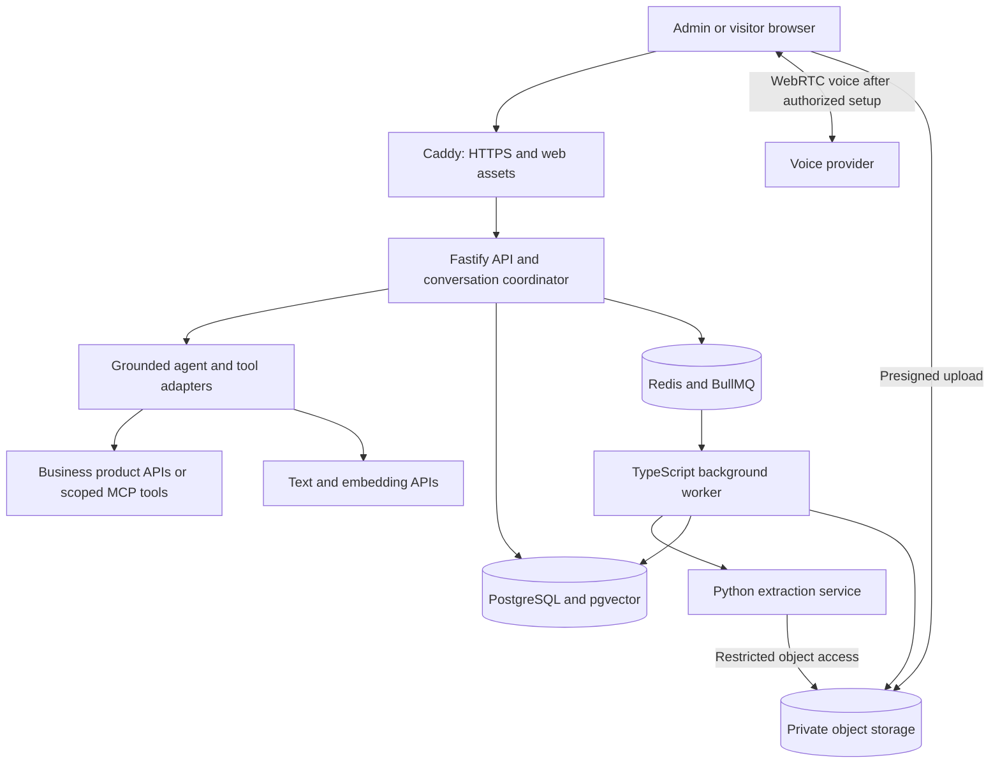

# Standalone sales assistant — engineering stack and deployment specification

Version 1.0 · 22 September 2026 · Proposed implementation

Audience: technical lead, frontend/backend engineers and deployment owner.

Companion to [the product specification](standalone-sales-agent-spec.md). That document defines product behavior, grounding, consent, sales outcomes and acceptance criteria. This document defines how to build and operate it. These are proposed choices, not an audit of existing infrastructure or a claim that the app is implemented.

Build in a **new repository with separate environments, credentials and releases**. WyvStudio is the first customer and an API integration, not the application's database or deployment target.

## 1. Recommended stack

| Layer | Choice | Responsibility |
|---|---|---|
| Admin and visitor frontend | Vue 3, TypeScript, Vite | Knowledge management, conversation UI, insights and settings |
| UI system | Tailwind CSS, accessible shared Vue components, CSS design tokens | Consistent branding, keyboard interactions, responsive layouts |
| Frontend state | Pinia for session/UI state; typed API client for server data | Avoid treating browser state as permission or billing truth |
| Backend | Node.js supported LTS, TypeScript, Fastify | Authentication, tenant scope, conversations, tools and integrations |
| Database access | PostgreSQL driver with parameterized SQL and versioned SQL migrations | Explicit transactions, row security, full-text and vector queries |
| Durable data | PostgreSQL with pgvector | Business data, transcripts, evidence, job records, embeddings |
| Background orchestration | Redis and BullMQ, TypeScript workers | Ingestion, indexing, analysis, retention and webhook processing |
| Extraction service | Python, FastAPI, isolated parser subprocesses | Documents, OCR, media metadata and extraction |
| Media tools | FFmpeg/ffprobe | Audio extraction, format normalization, keyframes and duration checks |
| Object storage | Private S3-compatible storage | Originals, derived files and optional consented recordings |
| Grounded text agent | OpenAI Responses API behind an application adapter | Answer drafting and structured tool use |
| Voice | GPT-Live with client delegation, subject to the integration spike | Low-latency speech interface to the grounded backend |
| Controlled voice fallback | Streaming transcription → validated text → speech synthesis | Alternative if live speech cannot meet factual-control requirements |
| Avatar | Separate, optional provider adapter | Not a dependency for text or voice launch |
| Admin identity | Managed OIDC provider | Admin login and MFA; app owns workspace membership and roles |
| Edge | Caddy, HTTPS | Static frontend hosting and API/stream proxying |
| Packaging | Docker, Docker Compose | Reproducible local, staging and first production deployment |
| Delivery | GitHub Actions and GHCR | Test, build, scan, publish immutable images, deploy serially |
| Observability | Structured JSON logs, OpenTelemetry, Sentry | Errors, traces, queue health and operating alerts |
| Product analytics | PostHog with content minimization | Funnel events and experiment assignment |
| Tests | Vitest, Playwright, pytest, database integration tests and agent evaluations | Product behavior, isolation, resilience and answer quality |

This is a recommendation for the new app. Vue fits the existing team's frontend work; TypeScript keeps browser, streaming and tool contracts close. Python is confined to extraction so the business logic does not split across two backends. Laravel would also be viable if staffing strongly favors PHP, but maintaining parallel Laravel and Fastify business APIs is outside this design.

Choose exact package versions at kickoff, record them in lockfiles and pin container images by digest. Use a production-supported Node LTS rather than automatically choosing the newest release. [Node release guidance](https://nodejs.org/en/about/previous-releases)

Vite supports Vue scaffolding, and Fastify provides TypeScript support. Neither choice removes the need for runtime request validation. [Vite documentation](https://vite.dev/guide/), [Fastify TypeScript documentation](https://fastify.dev/docs/latest/Reference/TypeScript/)

## 2. Application boundaries



Keep one modular backend, not a microservice for every feature. API and background worker share code and an image, but run as separate processes. CPU-heavy extraction never runs inside the API process. Voice setup and delegation belong to the API initially; split a dedicated live gateway only when connection load warrants it.

The browser receives only session-scoped voice authorization. Long-lived provider keys stay server-side. The implementation spike must confirm the actual GPT-Live SDK, transport, account access and delegation wiring before the engineering team commits to a production voice integration. The diagram does not specify unverified provider event names.

## 3. Frontend structure and behavior

Use one Vue application with separate admin and public route trees, and a small embed loader later. The initial visitor experience is a hosted page. The embed should use an iframe to isolate customer-site CSS and publish a narrow, origin-checked postMessage contract.

Suggested frontend modules:

- `admin/knowledge`: uploads, crawl setup, extraction progress, source preview, approval and version history.
- `admin/agent`: facts, playbook, preview laboratory and publication controls.
- `admin/conversations`: transcript, evidence, tool activity, objections and human corrections.
- `admin/insights`: funnel, costs, explicit purchase blockers and knowledge gaps.
- `visitor`: text conversation, voice controls, citations, example cards, plan cards and checkout CTA.
- `shared`: forms, dialogs, tooltips, upload lists, error boundaries and accessible media controls.

Use server-sent events for text and job progress; ordinary authenticated HTTP requests for user messages and actions. Maintain event sequence IDs and reconnect cursors. Reconnect must not create a second conversation or submit a message twice. Voice uses its own transport, not audio packets pushed through the text SSE channel.

Show states explicitly: connecting, listening, understanding, checking information, responding, reconnecting and unavailable. A network error must not masquerade as silence. Support stop-speaking, mute, text fallback and ending a session. Use visible plan details returned by the server, never a price invented in model prose.

Accessibility requirements: keyboard navigation, focus management, screen-reader labels, transcript access without sound, reduced-motion support and clear microphone permission recovery. Preserve draft text during recoverable failures. Disable only the action that is unavailable.

## 4. Backend modules and contracts

Organize Fastify modules around identity, tenants, knowledge, conversations, grounding, business tools, attribution, analysis and operations. Publish OpenAPI definitions for HTTP endpoints; validate incoming requests and model/tool outputs against strict runtime schemas.

| Proposed endpoint | Purpose and control |
|---|---|
| `POST /v1/uploads` | Authorize a private upload; enforce tenant quotas and expected size/type |
| `POST /v1/uploads/:id/complete` | Verify the stored object, then enqueue scanning/extraction |
| `POST /v1/sources/:id/publish` | Owner/editor approval of an extracted source version |
| `POST /v1/conversations` | Mint a visitor conversation with rate and budget checks |
| `POST /v1/conversations/:id/messages` | Idempotent message submission with conversation-scoped authorization |
| `GET /v1/conversations/:id/events` | Authorized event stream with replay cursor |
| `POST /v1/conversations/:id/voice-session` | Mint short-lived provider authorization after checking limits |
| `POST /v1/conversations/:id/end` | End session and enqueue analysis |
| `POST /v1/conversations/:id/checkout` | Validate selected plan and get a trusted checkout destination |
| `POST /v1/webhooks/:integration` | Verify signature/replay window and durably record before acknowledging |

Public agent IDs identify an agent, not a privileged tenant session. Derive tenant identity from the agent record or authenticated membership. Verify conversation authorization for every event, attachment and action. An unguessable URL alone is not sufficient authorization for admin or private customer records.

For admin sessions, use secure HttpOnly cookies, appropriate SameSite settings and CSRF protection. Map verified OIDC identity to application memberships; never trust tenant IDs or roles submitted by the browser. The provider selection is a procurement decision; OIDC keeps it replaceable.

## 5. Data model and tenant isolation

PostgreSQL is the authoritative store; Redis is scheduling/cache infrastructure. Core tables:

| Group | Records |
|---|---|
| Identity | tenants, users, memberships, agents, agent_versions |
| Knowledge | sources, source_versions, extraction_runs, chunks, embeddings, publication_records |
| Product truth | product_fact_versions, integration_configs, approved_examples |
| Conversation | conversations, turns, conversation_events, evidence_links, tool_executions |
| Sales | leads, handoff_requests, checkout_intents, purchase_events, attribution_links |
| Operations | jobs, outbox_events, usage_events, budget_reservations, audit_events, deletion_jobs |
| Analysis | conversation_analyses, objection_evidence, human_analysis_overrides |

Include tenant ID in tenant-owned rows and enforce matching tenant relationships with composite constraints where appropriate. Use PostgreSQL row-level security as defense in depth. Runtime roles must not own protected tables or bypass RLS. Set tenant context transaction-locally so pooled connections cannot retain another tenant's scope. Workers use the same isolation rules; migrations use a separate privileged role.

Store monetary amounts in minor units with currency; store usage quantities separately from money. Every conversation records agent version, source publication version, model configuration, consent state and experiment assignment. Store source locators as structured page, slide, cell range or time interval fields.

Use uniqueness constraints for provider event IDs, message idempotency keys, job stages and checkout intents. Namespace caches by tenant, agent version, publication version and authorization scope. Visitor attachments belong to their conversation and cannot enter the shared knowledge index.

## 6. Document and media processors

The TypeScript BullMQ worker owns job state and retries. It calls an internal authenticated Python service for extraction. Python does not separately implement the same scheduling/retry system. For long processing, return a processing ID and poll status; a timeout must not start a duplicate FFmpeg or OCR process.

| Input | Proposed processor | Output |
|---|---|---|
| URL | Restricted HTTP fetch plus readable-content extraction | Text, canonical URL, title and retrieval time |
| JavaScript-only page | Optional isolated Playwright worker, explicitly enabled | Rendered readable content within a crawl budget |
| PDF | pypdf text extraction; rendered pages plus Tesseract for scans | Page-labelled text and extraction-quality flags |
| DOCX | python-docx | Paragraphs and tables with section locators |
| PPTX | python-pptx | Slide text, notes and selected slide images |
| TXT/Markdown | Encoding-aware parser | Heading-aware text |
| CSV/XLSX | Standard CSV parser and openpyxl, bounded reads | Tables with sheet and cell locators |
| Image | OCR and optional vision description | Visible text and labelled visual observations |
| Audio | ffprobe, FFmpeg, transcription API | Timestamped transcript and media metadata |
| Video | ffprobe, audio extraction, transcription, selected keyframes with vision analysis | Time-aligned speech and visual observations |

Scanned PDFs need OCR; pypdf is not itself an OCR engine. Preserve this distinction in extraction status. [pypdf extraction limitations](https://pypdf.readthedocs.io/en/stable/user/extract-text.html)

Select a maintained PDF renderer during the parser spike and record its license. Check the exact FFmpeg build and enabled libraries when packaging, because obligations vary with build configuration. [FFmpeg licensing documentation](https://ffmpeg.org/legal.html)

Do not execute office macros, spreadsheet formulas, embedded scripts or uploaded HTML. Reject encrypted/unreadable files with a clear error. Inspect true file signatures and decoded dimensions/duration, not extensions alone. Run parsers with CPU, memory, process, scratch-space and wall-clock limits; no Docker socket and no host mounts. Give each task a restricted temporary directory and clean it after success or failure.

URL ingestion must reject private/link-local/metadata addresses, recheck resolved addresses on redirects and constrain network egress. A browser-based crawler requires the same protection. Arbitrary supplied URLs must not reach an unrestricted internal fetch tool.

Pipeline:

1. Issue a short-lived upload URL to a quarantine prefix.
2. Verify object ownership, actual bytes, file signature and quota; scan before extraction.
3. Extract into a versioned intermediate representation with provenance.
4. Flag poor OCR, missing audio, unsupported content or incomplete extraction.
5. Present admin preview; await approval for business knowledge.
6. Chunk and embed, then atomically publish the completed version.
7. Remove superseded content from active retrieval; retain permitted audit history.

Use the upload limits in the product spec as initial defaults. Duplicate files may reuse extraction only within authorized scope. A failed upload must not appear as ready knowledge. Images/video observations are model-derived interpretations, not independently verified product claims.

## 7. Retrieval, agent and model configuration

Use PostgreSQL full-text search plus pgvector, followed by a bounded reranking step when evaluation shows it helps. Filter by tenant, visibility, approved publication and expiry **before selecting evidence**. At POC scale, begin with exact vector search and measure before adding approximate indexes. [pgvector documentation](https://github.com/pgvector/pgvector)

Keep embeddings tied to a named model, dimension and index version. A model change creates a new index version and a controlled reindex; do not mix incompatible embeddings. Use versioned publication pointers for atomic cutover and rollback.

Model roles should be configurable independently:

- Answer model: supported Responses model that passes the grounded sales evaluation set.
- Embedding model: fixed dimension and revision, tested on the uploaded knowledge.
- Extraction vision model: describes diagrams or keyframes where text alone is insufficient.
- Transcription model: tested on expected languages and noisy customer audio.
- Analysis model: structured post-conversation classification with evidence.
- Voice model: validated GPT-Live integration, or the controlled speech chain.

Do not select exact model IDs solely from marketing benchmarks. Run a small bake-off against the same test set, then record accuracy, latency and actual billed cost. No automatic provider switching after a policy refusal. Transient transport failures may retry within a bounded budget; unsupported requests should be explained or handed off.

Application code enforces tool permissions, exact plan fields and source freshness. A semantic reviewer is useful but cannot guarantee no hallucinations. Evidence-bearing answers must pass checks before being sent as final text. Commercial cards are rendered from structured API facts. Customer-visible status messages can stream while validation runs.

MCP is optional integration transport, not a knowledge store or a reason to expose the full application. Implement narrow product API adapters first. If an MCP server is added, wrap the same allowlisted functions and tenant permissions. Never grant the public sales agent shell, SQL or unrestricted browsing access.

## 8. Voice and avatar engineering

Use GPT-Live client delegation to route knowledge-dependent work to the application-owned backend. Keep conversation context and tool authorization under application control. Validate delegated answers before releasing them. This controls backend output, but a voice model may still paraphrase; test the actual spoken result. [GPT-Live guide](https://developers.openai.com/api/docs/guides/live), [client delegation](https://developers.openai.com/api/docs/guides/live-delegation)

Implement cancellation tokens for each turn, sequence IDs, playback acknowledgements, disconnect handling and stale-result rejection. Store separate fields for generated text and what was actually played/heard where the transport exposes it. Do not mark a sales explanation delivered merely because text was generated.

If the live integration cannot meet factual requirements, switch to transcription → grounded text → TTS. The tradeoff is additional turn latency for stronger control over spoken content. [Voice architecture guidance](https://developers.openai.com/api/docs/guides/voice-agents)

Avatar work is a separate spike. Require a provider that accepts the chosen audio stream with synchronized video and interruption support. Confirm codecs, buffering, timing, browser support, costs and privacy terms. LiveAvatar is a candidate to evaluate; its existence does not prove compatibility with this voice stack. [LiveAvatar](https://www.liveavatar.com/)

One audio source must drive both audible playback and lip synchronization. Do not independently play GPT-Live audio alongside delayed avatar video/audio. Fall back to the voice UI on avatar failure. Use the measurable interruption and synchronization gates in the product spec before offering avatars to customers.

## 9. Queue reliability and spending controls

Use separate queue names and concurrency limits for extraction, indexing, analysis, integrations and retention. Live conversational requests should not wait behind video ingestion. Start with one heavy extraction task per processor container and raise concurrency only after measuring memory usage.

Design every job to tolerate repeat execution. BullMQ recommends idempotent jobs for reliable retries. Application-level database constraints and provider-operation records are still required. [BullMQ idempotent jobs](https://docs.bullmq.io/patterns/idempotent-jobs)

Write business state and an outbox event in one database transaction. A dispatcher publishes queued work; a reconciler recovers unprocessed outbox entries. Redis loss must not erase the only record that a source needs processing. Persist stage results so an embedding failure does not repeat transcription.

Use bounded exponential backoff with jitter for transient failures, explicit terminal statuses and a staff retry action. Store provider request IDs before retry decisions. Where a provider lacks idempotency or status lookup, an uncertain response needs reconciliation rather than a blind duplicate paid call.

Reserve an estimated budget atomically before paid work; reconcile with actual usage after completion. Set per-tenant and global ceilings, voice duration and idle limits, ingestion quotas and abuse controls. Provider invoices can lag; operational budgets require measured headroom. Track costs separately for voice duration, text, transcription, embeddings, vision and storage.

## 10. Docker layout and local development

Use three application images: `web` (compiled Vue assets and Caddy), `app` (API and worker entrypoints), and `processor` (Python and extraction binaries). Keep FFmpeg, OCR and document dependencies out of the API image.

| Compose service | Local | First production pilot |
|---|---|---|
| web | HTTPS/reverse proxy or local Vite development server | Caddy serves immutable assets and proxies API streams |
| api | App image with development override | App image pinned to release digest |
| worker | Same app image, worker command | Independently limited worker process |
| processor | Python image | Private network, resource limits, restricted egress |
| postgres | Local database with named volume and pgvector | Prefer managed PostgreSQL with pgvector and recovery support |
| redis | Local queue database | Managed compatible Redis or dedicated persistent instance |
| object storage | Local emulator or development-only bucket | Managed private object storage |
| mail sink | Local email capture | Approved transactional email provider |
| migrate | One-off profile/task | Explicit single migration job per release |

Keep `compose.yaml` as the base and separate local/production overrides. Production uses prebuilt images; source-code bind mounts belong only to development. Docker documents environment-specific Compose overrides. [Compose production guidance](https://docs.docker.com/compose/how-tos/production/)

Expose only HTTPS publicly. Database, Redis and processor ports stay private. Use non-root processes, read-only filesystems where possible, explicit temporary mounts and constrained capabilities. Secret files or a secret manager supply runtime credentials; never bake keys into images or frontend bundles.

Provide `.env.example` with names and explanations, no real values: database/Redis URLs, object storage settings, OIDC settings, provider keys, model configurations, allowed origins, budget limits, telemetry endpoints and webhook secrets. Validate configuration at startup.

Liveness means the process is functioning; readiness checks required dependencies. A model provider outage should produce degraded agent behavior and alerts, not necessarily restart a healthy API repeatedly. A Compose health status alone does not implement automatic recovery or zero-downtime routing.

## 11. Efficient builds and deployment

Build in GitHub Actions, not on the live host. Use multi-stage Dockerfiles, lockfile-first dependency layers, BuildKit cache, small build contexts and a strict `.dockerignore`. Cache the heavy processor image independently; frontend copy changes must not reinstall OCR dependencies.

Before selecting the runner, determine the target CPU architecture. Build natively for the target where possible; do not accidentally deploy an amd64-only image to an ARM host or incur slow emulation without a reason.

Pipeline requirements:

1. PR: lint, typecheck, unit/integration tests, frontend build, migration checks and relevant agent evaluations.
2. Release: build changed images, scan dependencies/images, publish to GHCR and write a manifest mapping all services to digests.
3. Staging: deploy that manifest and run a synthetic upload → approval → chat → test-checkout flow.
4. Production: acquire a deployment lock, verify backups and run backward-compatible migrations once.
5. Pull the tested images, start replacements, verify readiness and switch traffic.
6. Drain previous API sessions/workers, verify telemetry and preserve the prior manifest for rollback.

Use both GitHub environment concurrency and a server deployment lock so manual and automated deployments cannot collide. Do not cancel an in-flight production migration to start a newer deployment. Promote the same image digests tested in staging.

Single-instance replacement can interrupt active requests and voice coordination. For the POC, deploy during a quiet period with a clear reconnect experience. For a customer pilot requiring continuity, use two API slots behind the proxy: stop assigning new sessions to the old slot, route its existing sessions consistently, drain for a bounded period, then retire it. Preserve recoverable context durably; an in-memory connection itself cannot be migrated. Long jobs must finish or checkpoint before worker shutdown.

Use expand-and-contract database changes. Rollback normally restores the previous application images, not a destructive reverse migration. Separate destructive schema cleanup into a later release after compatibility is confirmed. Never include volume deletion, database recreation or broad Docker pruning in deployment scripts.

No claim of zero downtime or guaranteed deploy duration is made until the pipeline is exercised. Measure build, image pull, migration, readiness and drain time independently to identify the bottleneck.

## 12. Storage, backup and recovery

Recommend a separate small application VM with managed PostgreSQL and object storage for the pilot. Keep it off WyvStudio's production host unless a separate capacity and isolation review explicitly approves sharing. A single VM remains a single point of failure even with Docker.

Initial planning allowance: 4 vCPU and 8–16 GB RAM for API plus a single bounded extraction workload, excluding managed data services. This is a sizing hypothesis, not a supported concurrency claim. Hosted AI means no GPU is required initially. Increase or split processor capacity based on OCR/video memory peaks, not conversation count alone.

Proposed pilot recovery targets: database RPO at most 15 minutes, service RTO at most 4 hours. Select a backup/PITR arrangement capable of those targets and verify a restore before live use. Daily snapshots alone cannot meet a 15-minute RPO.

Back up PostgreSQL, object versions, integration configuration and deployment manifests. Keep backups in a separate failure domain with restricted access. Test restoring tenant data and reindexing knowledge. Queue reconciliation should rebuild missing scheduled work from the database.

Apply the product spec's retention rules to transcripts, media, derived chunks, indexes and backups. Deleted sources must disappear from live retrieval promptly. Maintain deletion tombstones and reapply them after restore so an old backup cannot silently republish deleted knowledge. Explain delayed expiry from immutable backups in the retention policy.

## 13. Monitoring and analytics

Use a correlation chain: tenant → conversation → turn → tool call or job → provider request. Redact secrets, tokens, raw uploads and unnecessary personal content from logs. Store transcripts in access-controlled application storage, not general-purpose error logs.

Operational dashboards should show API latency/errors, voice connection failures, delegation latency, extraction backlog, failed jobs, retrieval misses, unsupported answers, validation failures, webhook lag, budget consumption and database/storage health.

Alert on sustained review/answer-provider unavailability, cross-tenant authorization failures, checkout webhook failures, queue age exceeding the service target, exhausted budgets and rising ungrounded-answer rates. Alerts require an owner, destination and recovery runbook; logging alone is not an alert.

PostHog events should track conversation started, use case identified, qualified fit, example viewed, checkout clicked and verified purchase. Keep raw transcript content out of analytics by default. Mask conversation inputs/content if session replay is enabled. Purchase success comes from a signed server event, not a browser redirect or model statement.

Attribution must preserve existing affiliate information and distinguish assisted conversion from incremental lift. Use the product spec's control-group design before claiming the agent increased sales.

## 14. Repository and implementation deliverables

Suggested new monorepo:

```text
sales-assistant/
  apps/web/                 # Vue admin and visitor UI
  apps/api/                 # Fastify application
  apps/worker/              # BullMQ entrypoints
  services/processor/       # Python extraction service
  packages/contracts/      # Runtime schemas and API types
  packages/domain/         # Tenant-scoped business logic
  packages/agent/          # Grounding, tool and model adapters
  database/migrations/     # Reviewed SQL migrations
  evaluations/             # Grounding, spoken-answer and sales test cases
  deploy/                  # Dockerfiles, Compose, proxy and release scripts
  docs/runbooks/           # Deploy, rollback, restore and provider outage
  .github/workflows/       # Checks, image builds and deployment
```

Use a pnpm workspace and frozen lockfile for TypeScript; uv with a committed lockfile for Python. Record native binaries and image digests alongside package versions. Provide commands for local startup, seed data, tests, evaluations and migrations. Development fixtures must be synthetic or explicitly approved and redacted.

Required tests include real PostgreSQL/Redis integration tests, cross-tenant retrieval/attachment checks, duplicate webhook/job delivery, partial extraction failure, source deletion, malicious documents/URLs, stale pricing, prompt injection, voice interruption and reconnect, unavailable providers and budget exhaustion. Unit tests alone cannot validate these boundaries.

Use at least the 100 grounding/security cases from the product spec. Maintain a fixed release evaluation set and a separately evolving investigation set. Spoken answers need their own evaluation; passing text validation does not establish voice reliability.

## 15. Build order and release gates

| Stage | Deliverable | Gate |
|---|---|---|
| Integration spikes | Voice delegation, extraction fixtures, business facts API and cost measurements | Confirm account access, transport and representative file quality |
| Foundation | Auth, tenant boundaries, storage, job/outbox infrastructure and local Docker | Isolation and restart/retry tests pass |
| Knowledge and text | Approval, indexing, grounded conversation and evidence UI | Evaluation targets pass; unpublished knowledge cannot leak |
| Sales and analysis | Plan cards, checkout attribution, transcripts and evidenced objections | Duplicate-safe verified purchase events; no invented price claims |
| Voice | Interruptible, reconnectable, budgeted voice with text fallback | Actual spoken output meets grounding and latency gates |
| Pilot operations | Staging/production pipeline, monitoring, backup restore and runbooks | Successful restore, rollback rehearsal and load test |
| Optional avatar | Synchronized avatar adapter | Meets product spec's A/V and interruption targets |

At kickoff, confirm domain/name, target region, managed hosting and identity provider, supported languages, pilot budget, human-handoff destination and retention policy. Model IDs and any paid avatar contract are decided after the spikes. Everything else above is sufficiently concrete to start technical planning without modifying WyvStudio production.
